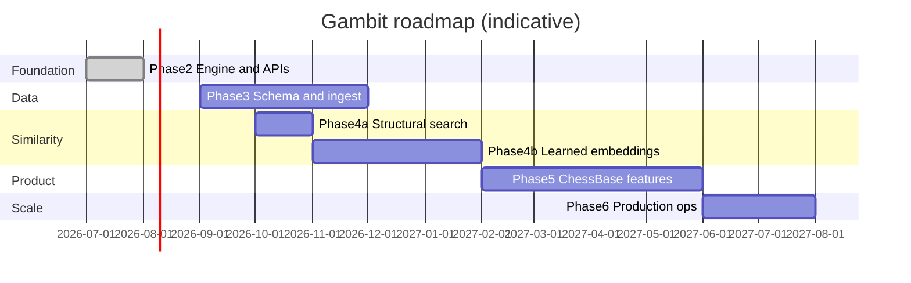

# Roadmap

Vision: **gambit-db** + **pg_chess** become the predominant chess database — faster than ad-hoc files, queryable in SQL, embeddable in any app via Rust/Python, and capable of **semantic position similarity** that rivals (and eventually surpasses) ChessBase-style structural search.

---

## What exists today (Phase 1 — done)

| Area | Status |
|------|--------|
| Workspace | `gambit-db`, `pg_chess`, `gambit-py`, `gambit-uci` |
| Correctness | Perft suite, 77+ unit tests, `#[pg_test]` SQL coverage |
| Quality gates | `scripts/check.ps1`, clippy, fmt, GitHub Actions CI |
| Benchmarks | Criterion baselines for movegen, apply, FEN, replay |
| Indexing | Zobrist hash, btree on `chess_position`, GIN on `chess_placement` |
| Engine core | Make/unmake stack, incremental `ChessGame`, mandatory occupancy bitboards |
| Notation | SAN parse/format, PGN parse/write (mainline + nested RAVs, NAGs, comments) |
| FEN | Strict semantic validation via `Position::from_fen` |
| APIs | Rust (`gambit_db::prelude`), SQL (`chess_*`), Python (`gambit-py`), UCI helpers |
| Tablebases | Optional `tablebase` feature: Syzygy WDL/DTZ via `shakmaty-syzygy` |

**Not yet present:** bulk ingest, player metadata, opening books, engine eval storage, embeddings, repertoire tools, or ChessBase-compatible import.

---

## Phase 2 — Engine hardening & APIs (done)

Goal: production-grade core before scaling data.

- Make/unmake move stack; `resolve_move` for fast `apply_move`
- Incremental `ChessGame` with `hash_history` (O(ply) threefold, no legal-move rescan)
- Mandatory occupancy bitboards in attack detection
- SAN, PGN (mainline + nested RAVs, NAGs, comments), strict FEN, UCI helpers, Syzygy probing (feature-gated)
- Opinionated public API: `prelude`, `Vec<Move>` legal moves, internal `Board`/`Undo`
- All `chess_*` SQL functions marked `IMMUTABLE` + `PARALLEL SAFE`; volatility regression test
- Criterion benchmark regression gate in CI (`scripts/bench_gate.sh`)

---

## Phase 3 — Database schema & bulk ingest

Goal: load **full databases** (millions of games) and query them at scale.

### Schema (PostgreSQL)

Core tables (sketch):

```sql
-- Games
games (id, pgn_text, white, black, event, date, elo_white, elo_black, result, source, imported_at)

-- Exploded positions (partitioned by source or year)
positions (game_id, ply, position chess_position, hash bigint, fen text)

-- Moves per ply
plies (game_id, ply, move chess_move, san text, uci text)

-- Aggregated opening stats (materialized)
opening_moves (prefix_hash, move_uci, count, wins, draws, losses)
```

Design choices:

- **Partition** `positions` / `plies` by `source` or `year` (Lichess monthly dumps, TWIC, personal CBH export)
- **Deduplicate** positions via Zobrist `hash` (transposition-aware); store canonical `chess_position`
- **Indexes:** btree on `(hash)`, `(game_id, ply)`, GIN on tags/players; consider BRIN on `imported_at`
- **Ingest workers:** Rust binary `gambit-ingest` — parallel PGN parser → COPY into Postgres (not row-by-row SQL)

### Import formats (priority order)

1. **PGN** — universal; Lichess exports, TWIC, Chess.com, personal collections
2. **CBV / ChessBase export** — via conversion tools or direct reader (proprietary; lower priority unless user base demands it)
3. **NDJSON / Parquet** — internal canonical interchange after first ingest
4. **Live API** — Lichess / Chess.com streaming (ongoing sync)

### Scale targets

| Tier | Games | Positions (approx) | Notes |
|------|-------|-------------------|-------|
| Dev | 10k | 500k | laptop + `cargo pgrx run` |
| Production | 10M | 500M | partitioned tables, dedicated PG cluster |
| Ambitious | 100M+ | 5B+ | columnar cold storage, position dedup table, separate OLAP |

### Estimated effort

~6–12 weeks (schema + ingest pipeline + first 10M-game load test).

---

## Phase 4 — Position similarity & embeddings (ChessBase replacement core)

This is the differentiator: **find positions like this one** — not just exact matches, but semantically similar structures (pawn chains, piece placement, king safety patterns) even when material differs slightly.

### Two complementary search modes

| Mode | Mechanism | Use case |
|------|-----------|----------|
| **Exact / transposition** | Zobrist `hash`, `chess_position` equality | "Has this position occurred before?" |
| **Structural** | Hand-crafted feature vector | "Same pawn structure, different minor pieces" |
| **Semantic** | Learned embedding vector | "Feels like a Benoni middlegame" / fuzzy similarity |

ChessBase mostly does **structural** search (material, board patterns). We can match that first, then exceed it with embeddings.

### 4a. Structural similarity (fast path, no ML)

Compute a fixed **feature vector** per position (~64–256 floats):

- Material count per piece type (normalized)
- Pawn structure hash per file (isolated, doubled, passed, backward)
- King square + castling rights
- Piece-square tables (white/black knight, bishop, rook counts per quadrant)
- Mobility estimate (legal move count, or pseudo-legal count as proxy)
- Side to move, game phase heuristic (opening/middlegame/endgame)

Store in Postgres with **pgvector**:

```sql
CREATE EXTENSION vector;

ALTER TABLE positions ADD COLUMN struct_embedding vector(128);

CREATE INDEX ON positions
  USING hnsw (struct_embedding vector_cosine_ops);
```

Query:

```sql
SELECT game_id, ply, fen, struct_embedding <=> $query_vec AS distance
FROM positions
ORDER BY struct_embedding <=> $query_vec
LIMIT 50;
```

**Effort:** ~3–4 weeks. Gets 80% of ChessBase "similar position" utility without training data.

### 4b. Learned semantic embeddings (modern path)

Train or adopt a model that maps `Position` → `vector(d)` where cosine distance ≈ human "similarity."

#### Option A — Board tensor encoder (recommended starting point)

- Input: 8×8×N planes (piece types, colors, castling, EP, side to move) — same representation as NNUE/Leela
- Architecture: small CNN or transformer (~1–5M params)
- Training signal (pick one or combine):
  - **Contrastive:** positions from same opening family / same eval cluster are close; random positions are far
  - **Next-move prediction:** shared encoder, predict legal move distribution; embedding = penultimate layer
  - **Engine eval regression:** positions with similar centipawn eval are closer
  - **Human labels:** expert "similar to" pairs from curated sets

#### Option B — Sequence encoder on move history

- Input: tokenized SAN/UCI sequence up to current ply
- Model: small transformer (ChessGPT-style)
- Pro: captures "opening identity" naturally
- Con: slower to compute; must re-embed when querying arbitrary FEN

#### Option C — Off-the-shelf / fine-tune

- Evaluate existing chess embedding research checkpoints
- Fine-tune on Lichess position pairs (same opening ECO code = positive pair)

#### Pipeline architecture

```
┌─────────────┐     ┌──────────────────┐     ┌─────────────────┐
│ chess_position│ → │ gambit-embed     │ → │ vector(d)       │
│ (FEN/board)  │     │ (Rust/onnx/trt)  │     │ stored in PG    │
└─────────────┘     └──────────────────┘     └─────────────────┘
                              ↑
                    batch job on ingest
                    + on-demand for queries
```

Components to build:

| Component | Description |
|-----------|-------------|
| `gambit-embed` crate | Rust inference: ONNX Runtime or `tract`; CPU + optional GPU |
| `position_embeddings` table | `(position_id, hash, embedding vector(d), model_version)` |
| `embed_positions(game_id)` | SQL function or background worker post-ingest |
| `chess_similar_positions(pos, k)` | SQL function returning top-k neighbors |
| Model registry | versioned weights; re-embed on model upgrade |

#### pgvector at scale

- **HNSW** index for low-latency ANN (<50ms for top-100 on 100M vectors with tuning)
- **IVFFlat** for larger/cheaper indexes where recall 95% is acceptable
- Store embeddings separately from hot `positions` table if width is large (d=384+)
- Consider **Qdrant** or **Milvus** sidecar only if PG vector search becomes bottleneck (unlikely until 1B+ vectors)

#### Estimated effort

| Milestone | Effort |
|-----------|--------|
| Structural vectors + pgvector | 3–4 weeks |
| ONNX inference crate + SQL wrappers | 2–3 weeks |
| Train v1 contrastive model on Lichess | 4–8 weeks (depends on ML familiarity) |
| Production embed pipeline at ingest | 2–3 weeks |
| `chess_similar_positions` SQL API | 1 week |

---

## Phase 5 — ChessBase-class product features

Features users expect when replacing ChessBase:

### Search & analysis

- [ ] Position search (exact + structural + semantic)
- [ ] Player search (games by name, Elo range, time control)
- [ ] Opening tree explorer (aggregated from ingested corpus)
- [ ] ECO / opening name assignment
- [ ] Move popularity and win/draw/loss stats from corpus
- [ ] Engine analysis storage (eval, depth, PV, multi-PV)
- [ ] Blunder / mistake detection (eval swing thresholds)

### Repertoire & preparation

- [ ] Repertoire as named move trees (stored games + tags)
- [ ] Coverage report: corpus responses to your repertoire
- [ ] Novelty detection (move not in database at depth N)
- [ ] Opponent prep: games by player + positions they reach

### Annotations & presentation

- [x] Variations (PGN RAV)
- [ ] Comments and symbols (NAGs)
- [ ] Game merging / deduplication
- [ ] Export PGN, FEN, study formats

### Modern takes (beyond ChessBase)

- [ ] **Similarity clusters** — auto-group games by middlegame embedding
- [ ] **Natural language search** — "find isolated queen pawn positions where white sacrificed the exchange" (LLM → structured query → SQL)
- [ ] **Trend dashboards** — opening popularity over time from ingest corpus
- [ ] **Real-time sync** — watch Lichess master games into DB
- [ ] **Federated queries** — Rust/Python API same semantics as SQL
- [ ] **Web UI** — board viewer + similarity graph (optional; API-first)

---

## Phase 6 — Predominant database operations

Goal: operable at the scale serious players and orgs depend on.

### Infrastructure

- Managed Postgres (or self-hosted) with pg_chess + pgvector
- Read replicas for search-heavy workloads
- Object storage (S3) for raw PGN archives
- Ingest queue (SQS/Redis) for async parsing
- Monitoring: ingest lag, embed queue depth, query p99

### Data licensing & sources

| Source | Size | License consideration |
|--------|------|----------------------|
| Lichess monthly PGN | ~500M+ games total | CC0 |
| TWIC | Weekly updates | Verify terms |
| FIDE OTB | Tournament games | Federation rules |
| Personal PGN | User-owned | User data |
| ChessBase CBV | Proprietary | No direct import without user export rights |

### Distribution

- `pg_chess` extension packages (Docker image with PG 18 + extensions preloaded)
- Hosted offering (optional SaaS) — Postgres-as-a-service with chess schema pre-baked

---

## Suggested timeline (single strong engineer, rough)



Parallelizable: Phase 4a can start during Phase 3 ingest.

---

## Decision log (open questions)

1. **Embedding dimension** — start 128 (structural), 256 (learned v1); tune after recall benchmarks
2. **CBH/CBV native reader** — defer unless enterprise users require it; PGN export from ChessBase may suffice
3. **Separate vector DB** — stay on pgvector until >500M embedded positions and p99 > 100ms
4. **Model hosting** — embed in Rust (ONNX) vs sidecar Python service (easier training loop)
5. **Canonical position ID** — Zobrist hash vs surrogate UUID when hash collisions are handled

---

## Success metrics

| Metric | Target |
|--------|--------|
| Ingest throughput | ≥100k games/minute (parallel Rust workers) |
| Exact position lookup | <10ms by hash on 500M positions |
| Similar position query | <100ms top-50 (HNSW, warm cache) |
| Perft / correctness | zero regressions; depth-5 perft in CI (optional nightly) |
| API parity | every SQL function callable from Rust and Python |
| Corpus | 10M+ games loaded with opening stats and embeddings |

---

## References & prior art

- **ChessBase** — structural position search, opening tree, player index
- **Lichess opening explorer** — move stats from corpus (we replicate + embed)
- **pgvector** — vector similarity in Postgres ([github.com/pgvector/pgvector](https://github.com/pgvector/pgvector))
- **Syzygy** — endgame tablebases
- **NNUE / Leela board encoding** — standard 8×8 plane representation for ML
- **Contrastive learning** — SimCLR/MoCo-style training for position embeddings without manual labels

---

## Next concrete steps

1. Phase 3: draft `schema/migrations/001_core.sql` and `gambit-ingest` CLI
2. Phase 4a: `struct_features(position) -> [f32; 128]` in Rust + pgvector column
3. Benchmark similarity recall against a ChessBase export sample (manual ground truth set)

See also: [architecture.md](architecture.md), [sql-api.md](sql-api.md).
